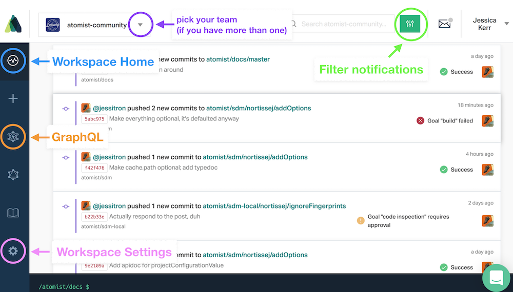

The Atomist web interface is located at [app.atomist.com](https://app.atomist.com). Here,
you can see some notifications, run GraphQL queries against your data, and administer your
Atomist workspace.

## Workspace Home

This page shows a list of notifications. You can filter it by person or repository using the filter button. Click on a notification to see details, including usefule buttons.

## Web command line

At the bottom of the Workspace Home screen is a place to type commands. Unlike chat, this interface
supports tab-completion. 

Try:

* `ls` lists contexts you can move into; you can descend into an organization and then repository.
* `cd` into an organization, and then `cd` into a repository. Now Atomist has context for your command.
* type a letter and push tab. This gives you a list of commands you can type.
* enter one of the listed commands plus `-h` to see the parameters you could pass.

For instance, you can use this command-line interface to restart all the goals on your last commit:

* `cd` into the owner/repo of your repository
* type `plan goals ` and push `tab` to see the SDMs that are available. Then complete the command with the name of the SDM that runs goals on this repository for you.
* To see that the goals started over, check the [Workspace Home](#workspace-home) page, and filter for your repository.

Currently this interface doesn't provide the output of the commands. Any messages sent by the command appear as notifications at the top the web application.